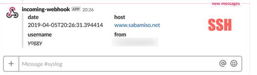

# ssh-slack-notifier.py

## How to setup

    $ git clone https://github.com/yoggy/ssh-slack-notifier.git
    $ cd ssh-slack-notifier
    $ vi ssh-slack-notifier.py
    
        SLACK_INCOMING_WEBHOOK_URL = ""
                   ↓
        SLACK_INCOMING_WEBHOOK_URL = "your slack incoming webhook URL"

    $ sudo scp ssh-slack-notifier.py /usr/local/bin
    
    $ sudo vi /etc/ssh/sshrc
    
        #!/bin/sh
        /usr/local/bin/ssh-slack-notifier.py $USER $SSH_CLIENT

## Copyright and license
Copyright (c) 2019 yoggy

Released under the [MIT license](LICENSE.txt)
